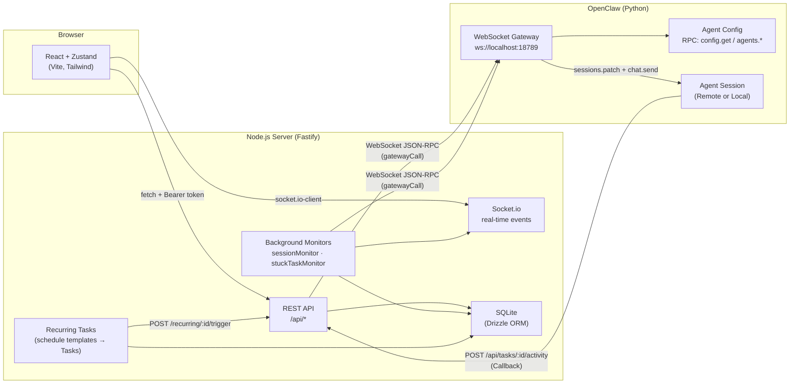

# Claw-Pilot

**Mission Control dashboard for [OpenClaw](https://github.com/openclaw/openclaw) AI agents.**

Claw-Pilot is a real-time Kanban + chat interface built in a Yarn/Turborepo monorepo. It bridges a React frontend to a Fastify backend, which in turn drives OpenClaw agents via the OpenClaw **WebSocket gateway RPC API**.

---

## Architecture



> **Data flow summary:** The React UI communicates with the Fastify server via REST (Bearer-token auth) and Socket.io. The server communicates with OpenClaw agents through the **WebSocket gateway RPC API** — never via CLI subprocess. Each RPC call (`gatewayCall`) opens a fresh WebSocket connection, performs a **Mode-A (Device Identity)** handshake, fires one JSON-RPC method, reads the response, and closes. Background monitors run on server-side intervals and push real-time events to the UI via Socket.io. Agents can report progress or completion by calling back to the backend's REST API, triggering automatic status transitions in the Kanban board.

---

## Getting Started

### Prerequisites

| Tool | Version |
| :--- | :--- |
| Node.js | 22+ |
| Yarn | 1.22+ |
| OpenClaw | running with WebSocket gateway enabled (`ws://localhost:18789`) |

### 1. Clone & install

```bash
git clone https://github.com/radekstepan/claw-pilot.git
cd claw-pilot
yarn install
```

### 2. Configure environment

Generate both `.env` files with a single matching `API_KEY` (the key must be identical in both):

```bash
KEY=$(openssl rand -hex 32)
printf "PORT=54321\nAPI_KEY=$KEY\n" > apps/backend/.env
printf "VITE_API_URL=http://localhost:54321\nVITE_SOCKET_URL=http://localhost:54321\nVITE_API_KEY=$KEY\n" > apps/frontend/.env
```

> **Why two files?** The backend validates every request against `API_KEY`; the frontend must send the same value as a `Bearer` token. Mismatched keys produce 401 errors on boot.

**Backend variables** (`apps/backend/.env`):

| Variable | Required | Default | Description |
| :--- | :---: | :--- | :--- |
| `API_KEY` | ✅ | — | Shared secret — frontend must send `Authorization: Bearer <key>`. Also used by agents for remote callbacks. |
| `PORT` | | `54321` | HTTP port for the Fastify server |
| `HOST` | | `127.0.0.1` | Interface to bind — use `0.0.0.0` for Docker or Tailscale/remote visibility |
| `ALLOWED_ORIGIN` | | `http://localhost:5173` | CORS origin for the frontend |
| `NODE_ENV` | | `development` | `development` / `production` / `test` |
| `OPENCLAW_GATEWAY_URL` | | `ws://localhost:18789` | WebSocket URL of the OpenClaw gateway |
| `OPENCLAW_GATEWAY_TOKEN` | | _(none)_ | Bearer token appended as `?token=…` to each gateway connection |
| `OPENCLAW_GATEWAY_ID` | | `gateway` | Gateway identifier — used to build the main agent session key |
| `OPENCLAW_WS_TIMEOUT` | | `15000` | Timeout (ms) for fast RPC calls (health, sessions list, models) |
| `OPENCLAW_AI_TIMEOUT` | | `120000` | Timeout (ms) for heavy AI calls (chat, agent generation) |
| `OPENCLAW_DEVICE_IDENTITY_PATH`| | `data/device-identity.json` | Path to the Ed25519 key pair + deviceToken file |
| `PUBLIC_URL` | | `http://localhost:{PORT}` | Publicly reachable base URL of this server. Embedded in every dispatched agent prompt as the callback URL. **Must be set when Claw-Pilot and OpenClaw run on different machines** (e.g. `http://100.78.90.125:54321`). |
| `AI_QUEUE_CONCURRENCY` | | `3` | Max concurrent AI gateway calls (`routeChatToAgent`, `spawnTaskSession`). Excess requests are queued. Lower values protect resource-constrained hosts (local LLMs); raise for capable servers. Range: 1–50. |

**Frontend variables** (`apps/frontend/.env`):

| Variable | Required | Default | Description |
| :--- | :---: | :--- | :--- |
| `VITE_API_URL` | ✅ | `http://localhost:54321` | Full URL of the backend |
| `VITE_SOCKET_URL` | ✅ | `http://localhost:54321` | Socket.io URL (usually same as `VITE_API_URL`) |
| `VITE_API_KEY` | ✅ | — | Must match the backend `API_KEY` |

**No OpenClaw gateway?** The backend starts and all non-AI routes (tasks, activities, recurring) work without a live gateway. After the first monitor tick (~10 s) the frontend will show a yellow banner: _"OpenClaw gateway unreachable — AI features are offline."_ The banner disappears automatically when the gateway comes back.

### 3. Run in development

```bash
# Terminal 1 — backend (hot-reload)
yarn workspace backend dev

# Terminal 2 — frontend (Vite dev server)
yarn workspace frontend dev
```

**No OpenClaw gateway running?** Point `OPENCLAW_GATEWAY_URL` at a local stub or skip gateway-dependent endpoints. The backend starts and all non-AI routes (tasks, activities, recurring) work without a live gateway.

### 4. Run in production (Docker)

```bash
# Build the image
docker compose build

# Start (set API_KEY in environment or a .env file at the repo root)
API_KEY=your-secret docker compose up -d
```

The container:
- Mounts `~/.openclaw` (or `$OPENCLAW_CONFIG_DIR`) as read-only at `/openclaw`
- Persists `data/db.json` in the `claw_data` Docker volume
- Serves the pre-built Vite frontend statically from Fastify at port `54321`
- Receives `SIGTERM` for graceful shutdown (15 s grace period)

---

## Workflow: Task Execution

Claw-Pilot is designed for an autonomous task loop. You move tasks from **Inbox** to **Assigned** (manually), then dispatch them to agents.

1.  **Creation**: Create a task in the **Inbox**.
2.  **Assignment**: Drag the task to the **Assigned** column.
3.  **Dispatch**: Open the Task Modal, select an agent from the "Dispatch to Agent" drop-down, and click **Route Task**.
    *   The backend creates an isolated OpenClaw session (`mc-gateway:{id}:main`) using the specified model.
    *   The task title + description are sent as the initial prompt with `deliver: true`.
    *   The `taskId`, full callback URL, and `API_KEY` are **automatically appended** to the prompt — the agent knows exactly where to POST back without any manual configuration.
    *   The task automatically moves to **In Progress**.
4.  **Work**: The agent performs its work.
5.  **Completion**: When the agent finishes, it calls back to the backend. If it includes the word `completed` or `done` in its message, the task moves to **Review**.
6.  **Human Review**: You approve or reject the work. Approval moves it to **Done**. Rejection moves it back to **In Progress** with your feedback.

> **Remote Agents:** See [docs/api.md](docs/api.md#8-agent-callback-protocol-remote-setup) for how to configure agents running on a separate VPS (e.g., via Tailscale) to call back to your local machine.

---

## Monorepo Structure

```
claw-pilot/
├── apps/
│   ├── backend/             # Fastify + Socket.io + LowDB + CLI bridge
│   │   ├── src/
│   │   │   ├── config/env.ts    # Zod-validated env config (fail-fast boot)
│   │   │   ├── middleware/auth.ts
│   │   │   ├── monitors/        # sessionMonitor · stuckTaskMonitor
│   │   │   ├── openclaw/cli.ts  # WebSocket gateway client (gatewayCall + higher-level functions)
│   │   │   ├── routes/          # tasks · chat · agents · models · recurring …
│   │   │   ├── db.ts            # LowDB + atomic write + hourly backup
│   │   │   ├── app.ts           # Fastify factory + static serving
│   │   │   └── index.ts         # Startup + Socket.io + graceful shutdown
│   │   ├── data/db.json         # Runtime database (gitignored in prod)
│   │   └── scripts/
│   │       ├── openclaw         # Mock CLI binary (for dev:mock)
│   │       └── setup-mock-env.mjs
│   └── frontend/            # React 18 + Vite + Zustand + Tailwind
│       └── src/
│           ├── components/ui/   # ConfirmDialog · Select · EmptyState …
│           ├── store/           # useMissionStore (Zustand)
│           └── hooks/           # useSocketListener
├── packages/
│   └── shared-types/        # Zod schemas + TypeScript interfaces
├── docs/
│   ├── api.md               # Full REST + WebSocket reference
│   └── polish.md            # Production-readiness checklist
├── Dockerfile
├── docker-compose.yml
└── AGENTS.md                # AI coding guidelines for this repo
```

---

## Key Design Decisions

| Decision | Rationale |
| :--- | :--- |
| WebSocket RPC not `execFile` | Each `gatewayCall` opens a fresh WS, authenticates (Mode A / backend), issues one JSON-RPC method, and closes — no persistent socket or CLI process needed |
| Mode A Auth (Device Identity) | Provides secure, persistent pairing without passwords. A stable Ed25519 key pair is stored in `data/device-identity.json` |
| Atomic db writes | Drizzle ORM with SQLite transactions + WAL mode — a mid-write crash never corrupts the database |
| 202 Accepted for AI calls | AI gateway calls take minutes; HTTP requests must not block. The result is pushed via Socket.io |
| Agent Callback Logic | Remote agents notify the backend of completion via HTTP POST, moving tasks to `REVIEW` autonomously |
| `timingSafeEqual` for API key | Prevents timing side-channel attacks |
| Fresh WS per RPC call | No connection-state management; failures are isolated; the gateway is stateless from the client's perspective |

---

## Scripts Reference

| Package | Script | Purpose |
| :--- | :--- | :--- |
| `backend` | `dev` | Start backend with hot-reload (`tsx watch`) |
| `backend` | `dev:mock` | Start backend with fake OpenClaw CLI (no Python needed) |
| `backend` | `build` | Compile TypeScript to `dist/` |
| `backend` | `start` | Run compiled production build |
| `backend` | `test` | Run Vitest unit tests |
| `frontend` | `dev` | Start Vite dev server |
| `frontend` | `build` | Build to `dist/` |
| `frontend` | `test` | Run Vitest + React Testing Library |
| root | `build` | Turbo build all packages |

---

## License

MIT
