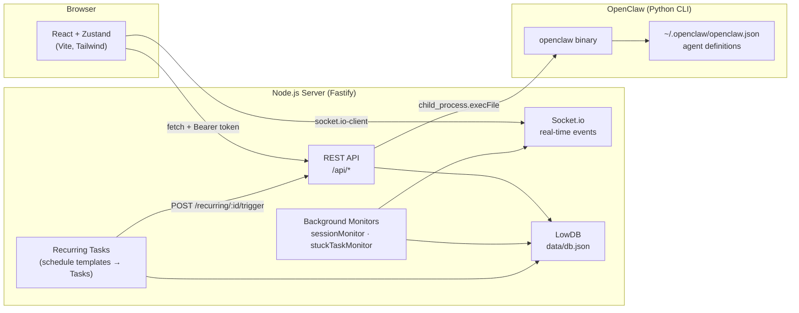

# Claw-Pilot

**Mission Control dashboard for [OpenClaw](https://github.com/openclaw/openclaw) AI agents.**

Claw-Pilot is a real-time Kanban + chat interface built in a Yarn/Turborepo monorepo. It bridges a React frontend to a Fastify backend, which in turn drives OpenClaw agents via its Python CLI.

---

## Architecture



> **Data flow summary:** The React UI communicates with the Fastify server exclusively via REST (Bearer-token auth) and Socket.io. The server drives OpenClaw agents through `child_process.execFile` — never via an npm import. Background monitors run on server-side intervals and push real-time events to the UI via Socket.io, eliminating the need for frontend polling.

---

## Getting Started

### Prerequisites

| Tool | Version |
| :--- | :--- |
| Node.js | 22+ |
| Yarn | 1.22+ |
| OpenClaw | installed & on `$PATH` |

### 1. Clone & install

```bash
git clone https://github.com/radekstepan/claw-pilot.git
cd claw-pilot
yarn install
```

### 2. Configure environment

Copy the example file and fill in the required values:

```bash
cp apps/backend/.env.example apps/backend/.env
```

| Variable | Required | Default | Description |
| :--- | :---: | :--- | :--- |
| `API_KEY` | ✅ | — | Shared secret — frontend must send `Authorization: Bearer <key>` |
| `PORT` | | `54321` | HTTP port for the Fastify server |
| `HOST` | | `127.0.0.1` | Interface to bind — use `0.0.0.0` inside Docker |
| `ALLOWED_ORIGIN` | | `http://localhost:5173` | CORS origin for the frontend |
| `NODE_ENV` | | `development` | `development` / `production` / `test` |
| `CLI_TIMEOUT` | | `15000` | Timeout (ms) for fast CLI calls (sessions list, models) |
| `AI_TIMEOUT` | | `120000` | Timeout (ms) for heavy AI calls (chat, agent generation) |
| `OPENCLAW_HOME` | | `~/.openclaw` | Root of the OpenClaw config directory — override for Docker |

Frontend variables (in `apps/frontend/.env`):

| Variable | Required | Default | Description |
| :--- | :---: | :--- | :--- |
| `VITE_API_URL` | ✅ | — | Full URL of the backend, e.g. `http://localhost:54321` |
| `VITE_SOCKET_URL` | ✅ | — | Socket.io URL (usually same as `VITE_API_URL`) |
| `VITE_API_KEY` | ✅ | — | Must match the backend `API_KEY` |

### 3. Run in development

```bash
# Terminal 1 — backend (hot-reload)
yarn workspace backend dev

# Terminal 2 — frontend (Vite dev server)
yarn workspace frontend dev
```

**No OpenClaw installed?** Use the mock CLI so you can develop the UI without any Python dependencies:

```bash
yarn workspace backend dev:mock
```

This creates `~/.openclaw-mock/openclaw.json` with two synthetic agents and intercepts all `execFileAsync('openclaw', ...)` calls with instant JSON responses.

### 4. Run in production (Docker)

```bash
# Build the image
docker compose build

# Start (set API_KEY in environment or a .env file at the repo root)
API_KEY=your-secret docker compose up -d
```

The container:
- Mounts `~/.openclaw` (or `$OPENCLAW_CONFIG_DIR`) as read-only at `/openclaw`
- Persists `data/db.json` in the `claw_data` Docker volume
- Serves the pre-built Vite frontend statically from Fastify at port `54321`
- Receives `SIGTERM` for graceful shutdown (15 s grace period)

---

## Monorepo Structure

```
claw-pilot/
├── apps/
│   ├── backend/             # Fastify + Socket.io + LowDB + CLI bridge
│   │   ├── src/
│   │   │   ├── config/env.ts    # Zod-validated env config (fail-fast boot)
│   │   │   ├── middleware/auth.ts
│   │   │   ├── monitors/        # sessionMonitor · stuckTaskMonitor
│   │   │   ├── openclaw/cli.ts  # child_process wrappers
│   │   │   ├── routes/          # tasks · chat · agents · models · recurring …
│   │   │   ├── db.ts            # LowDB + atomic write + hourly backup
│   │   │   ├── app.ts           # Fastify factory + static serving
│   │   │   └── index.ts         # Startup + Socket.io + graceful shutdown
│   │   ├── data/db.json         # Runtime database (gitignored in prod)
│   │   └── scripts/
│   │       ├── openclaw         # Mock CLI binary (for dev:mock)
│   │       └── setup-mock-env.mjs
│   └── frontend/            # React 18 + Vite + Zustand + Tailwind
│       └── src/
│           ├── components/ui/   # ConfirmDialog · Select · EmptyState …
│           ├── store/           # useMissionStore (Zustand)
│           └── hooks/           # useSocketListener
├── packages/
│   └── shared-types/        # Zod schemas + TypeScript interfaces
├── docs/
│   ├── api.md               # Full REST + WebSocket reference
│   └── polish.md            # Production-readiness checklist
├── Dockerfile
├── docker-compose.yml
└── AGENTS.md                # AI coding guidelines for this repo
```

---

## Key Design Decisions

| Decision | Rationale |
| :--- | :--- |
| `execFile` not `exec` | Prevents shell-injection; args are passed as an array, not a shell string |
| Atomic db writes (`db.tmp.json` → rename) | POSIX `rename(2)` is atomic — a mid-write crash never corrupts `db.json` |
| Hourly `db.backup.json` | Secondary safety net against logical corruption |
| 202 Accepted for AI calls | AI CLI calls can take minutes; HTTP requests must not block |
| `timingSafeEqual` for API key | Prevents timing side-channel attacks |
| `OPENCLAW_HOME` env var | Enables Docker deployments without hardcoded `os.homedir()` paths |

---

## Scripts Reference

| Package | Script | Purpose |
| :--- | :--- | :--- |
| `backend` | `dev` | Start backend with hot-reload (`tsx watch`) |
| `backend` | `dev:mock` | Start backend with fake OpenClaw CLI (no Python needed) |
| `backend` | `build` | Compile TypeScript to `dist/` |
| `backend` | `start` | Run compiled production build |
| `backend` | `test` | Run Vitest unit tests |
| `frontend` | `dev` | Start Vite dev server |
| `frontend` | `build` | Build to `dist/` |
| `frontend` | `test` | Run Vitest + React Testing Library |
| root | `build` | Turbo build all packages |

---

## License

MIT
