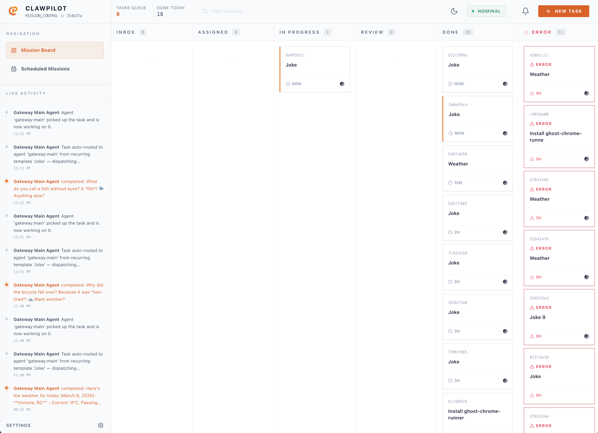
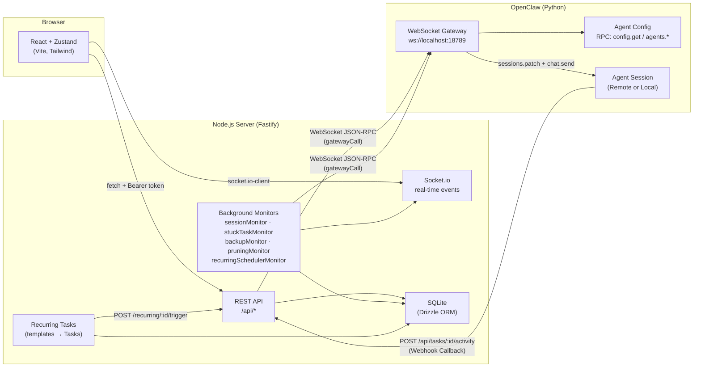

# Claw-Pilot

Mission Control dashboard for *Claw AI agents.

Claw-Pilot is a real-time Kanban and chat interface built in a Yarn/Turborepo monorepo. It connects a React frontend to a Fastify backend, which orchestrates OpenClaw/NanoClaw agents via the WebSocket gateway RPC API.



---

## Architecture



Data flow summary: The React UI communicates with the Fastify server via REST (Bearer-token auth) and Socket.io. The server communicates with OpenClaw agents through the WebSocket gateway RPC API. Each RPC call opens a fresh WebSocket connection, performs a handshake, fires one JSON-RPC method, and closes. Background monitors run on server-side intervals and push real-time events to the UI via Socket.io. Agents can report progress or completion by calling back to the backend REST API, triggering status transitions in the Kanban board.

---

## Features

- Real-time Kanban board for task management.
- Integrated chat interface for communicating with agents.
- Automatic task status transitions via agent webhooks.
- Multi-agent support and configuration.
- Recurring task templates with cron-based scheduling.
- Automated system monitoring and recovery (stuck tasks, session health, backups).
- Drizzle ORM with SQLite for reliable local storage.

---

## Getting Started

### Prerequisites

| Tool | Version |
| :--- | :--- |
| Node.js | 22+ |
| Yarn | 1.22+ |
| OpenClaw | Running with WebSocket gateway enabled |

### 1. Clone & install

```bash
git clone https://github.com/radekstepan/claw-pilot.git
cd claw-pilot
yarn install
```

### 2. Configure environment

Generate both .env files with a single matching API_KEY:

```bash
KEY=$(openssl rand -hex 32)
printf "PORT=54321\nAPI_KEY=$KEY\n" > apps/backend/.env
printf "VITE_API_URL=http://localhost:54321\nVITE_SOCKET_URL=http://localhost:54321\nVITE_API_KEY=$KEY\n" > apps/frontend/.env
```

The backend validates every request against API_KEY; the frontend must send the same value as a Bearer token.

### 3. Database setup

Initialize the SQLite database and run migrations:

```bash
cd apps/backend
yarn db:generate
yarn db:migrate
cd ../..
```

### 4. Run the application

Start both the backend and frontend in development mode using Turborepo:

```bash
# From the root directory
yarn dev
```

The dashboard will be available at http://localhost:5173.

---

## Configuration Reference

### Backend variables (apps/backend/.env)

| Variable | Required | Default | Description |
| :--- | :--- | :--- | :--- |
| BACKEND_TYPE | | openclaw | Choose gateway backend: openclaw or nanoclaw. |
| API_KEY | Yes | - | Shared secret for authentication. |
| PORT | | 54321 | HTTP port for the Fastify server. |
| HOST | | 127.0.0.1 | Interface to bind. |
| ALLOWED_ORIGIN | | http://localhost:5173 | CORS origin for the frontend. |
| OPENCLAW_GATEWAY_URL | | ws://localhost:18789 | URL of the OpenClaw gateway. |
| PUBLIC_URL | | http://localhost:{PORT} | Publicly reachable base URL for callbacks. |
| AI_QUEUE_CONCURRENCY | | 3 | Max concurrent AI gateway calls. |

---

## Development

### Project Structure

- apps/frontend: React dashboard (Vite, Tailwind, Zustand).
- apps/backend: Fastify server (Drizzle ORM, SQLite, Socket.io).
- packages/shared-types: Zod schemas and TypeScript interfaces.

### Commands

- yarn dev: Start both frontend and backend.
- yarn build: Build both projects for production.
- yarn test: Run the test suite across the monorepo.
- yarn lint: Run ESLint.
- yarn db:generate: Generate Drizzle migrations.
- yarn db:migrate: Apply pending migrations.
